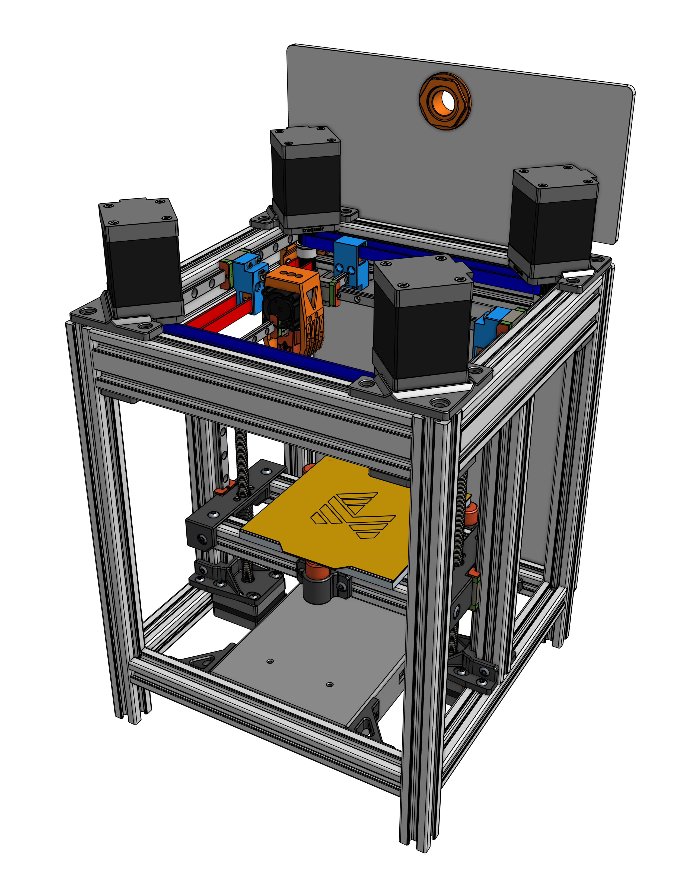

# Traquair

Project status: **beta**

Small format DIY crossed gantry 3D-printer. This is the first public beta release.

Inspired by 💚 [Annex Engineering](https://github.com/Annex-Engineering) & ❤️  [Voron Design](https://vorondesign.com/)
