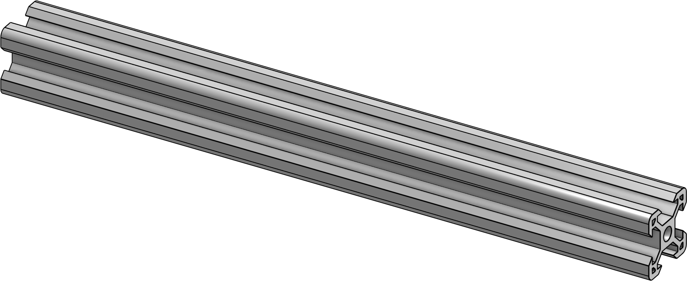
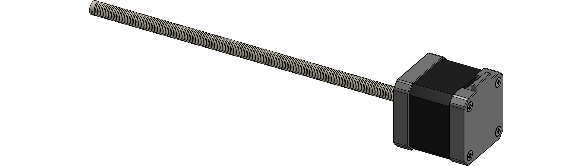

# Bed frame
{: .no_toc }

This is the print surface of the printer.

# Contents
{: .no_toc }

1. TOC
{:toc}

## Required parts

| Amount | Item                           |      |
|--------|--------------------------------|------|
| 8      | 2020 aluminium extrusion 200mm |  |
| 2      | MGN9C 200mm |  |
| 2      | NEMA17 with 200mm lead screw |  |
| 2      | TR8x8 anti-backlash nut |  |
| 3      | Silicone buffer |  |
| 1      | 120x120x8mm toolplate |  |
| 1      | 120x120mm magnetic PEI sheet |  |
| **Fasteners** |||
| 4      | Threaded heat insert M3xH4xD5mm |  |
| 4      | M3x8mm SHCS |  |
| **Printed parts** |||
| 2      | Z bed mount |  |
| 3      | Z bed spacer holder |  |

## Next steps

You can now proceed to building the [motor assemblies](motor.html).