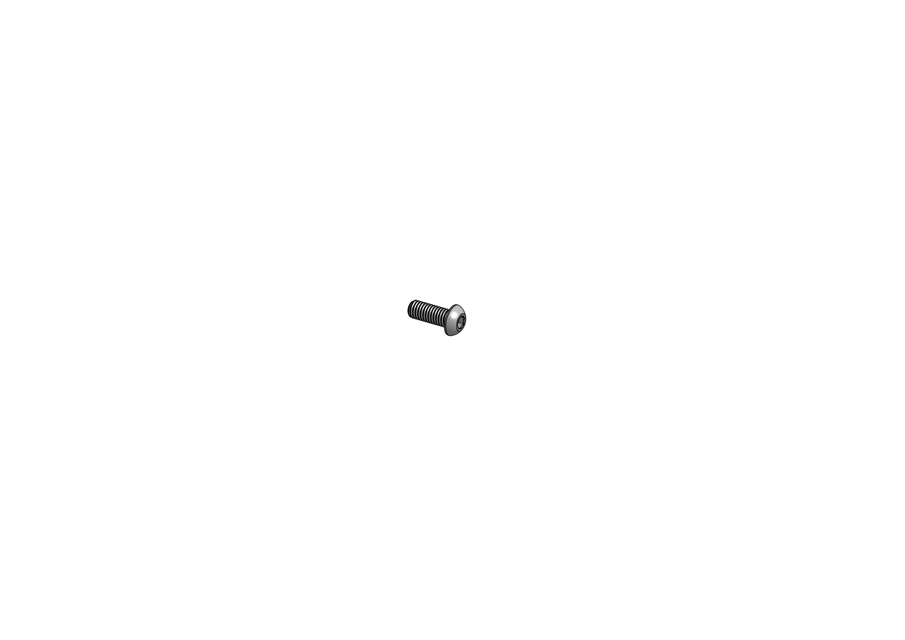

# Base frame

This is the basis of the printer.

## Required parts

| Amount | Item                           |      |
|--------|--------------------------------|------|
| 4      | 2020 aluminium extrusion 300mm |  |
| 4      | 2040 aluminium extrusion 220mm |  |
| 16     | M6x16mm SBHS |  |
| **Printed parts** |||
| 1      | Blind hole jig |  |

## Step 1: Drill blind holes

Using the *Blind Hole Drill Jig*, we will drill one side of all four
2020 extrusions, both in front and on the sides.

## Step 2: Tap extrusions

In order to be able to insert the socket head screws into the sides of the
2040 extrusions, the sides needs to be tapped with an M6 tap.

## Step 3: Bolt it together

First, insert the M6 bolts into the 2040 holes you just tapped, then slide
the bolt heads into the vertical 2020 extrusion and tighten them down. Make
sure you keep the frame squared before tightening the bolts.

## Done

You can now proceed to building the [bed frame](bed-frame.html).