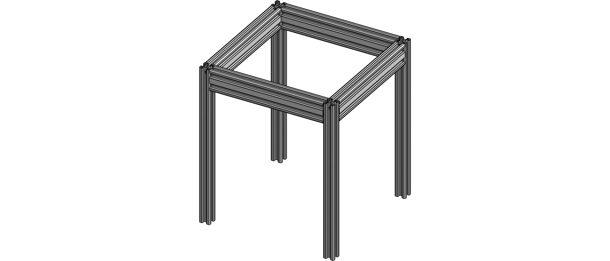

# Base frame
{: .no_toc }

This is the basis of the printer.

# Contents
{: .no_toc }

1. TOC
{:toc}

## Required parts

| Amount | Item                           |      |
|--------|--------------------------------|------|
| 4      | 2020 aluminium extrusion 300mm |  |
| 4      | 2040 aluminium extrusion 220mm |  |
| **For I-type "Misumi" frames** |||
| 16     | M5x16mm BHCS |  |
| **For B-type "Bosch" frames** |||
| 16     | M6x16mm BHCS |  |
| **Printed parts** |||
| 1      | Top blind holes jig |  |
| 1      | Bottom blind hole jig |  |

*Multiple standards exist for aluminium 20x20mm and 20x40mm T-slot extrusions, the most
common ones are "Misumi" type with an M5 center tap and "Bosch" type with a M6 center tap. Make
sure you get blind hole screws that match the frame!*

| Misumi extrusion | Bosch extrusion |
|-|-|
|  |  |

## Step 1: Drill blind holes

Using the *Top blind holes jig*, we will drill one side of all four
2020 extrusions, both in front and on the sides. The opposite site
gets a single hole using the *Bottom blind hole jig*.

## Step 2: Tap extrusions

In order to be able to insert the socket head screws into the sides of the
2040 extrusions, the sides needs to be tapped with an M6 tap.

For the motor mounts, the top of the 2020 extrusions need to be tapped as well,
this is the side where also the blind holes are drilled.

## Step 3: Bolt it together

First, insert the M6 bolts into the 2040 holes you just tapped, then slide
the bolt heads into the vertical 2020 extrusion and tighten them down. Make
sure you keep the frame squared before tightening the bolts.

## Next steps

You can now proceed to building the [Z frame](z-frame.html).