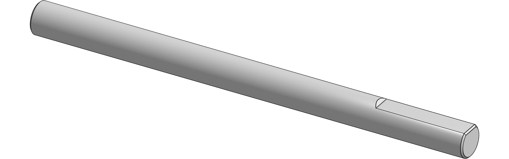
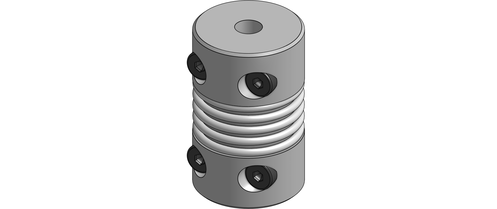

# Motor assembly
{: .no_toc }

You need four of these motor assemblies in total.

# Contents
{: .no_toc }

1. TOC
{:toc}

## Required parts

| Amount | Item                            |      |
|--------|---------------------------------|------|
| 4      | NEMA14 48mm                     |  |
| 4      | 2GT 20T Idler 9mm               |  |
| 4      | 2GT 20T Pulley 9mm              |  |
| 4      | Shaft 5x70mm                    |  |
| 8      | Bearing 625ZZ                   |  |
| 4      | Corrugated D16L28 5x5mm coupler |  |
| **Fasteners** |||
| 8      | M5x10mm BHCS                    |  |
| 8      | M5x16mm BHCS                    |  |
| **For I-type "Misumi" frames** |||
| 8      | M5x16mm BHCS                    |  |
| **For B-type "Bosch" frames** ||
| 8      | M6x16mm BHCS                    |  |
| **Printed parts** |||
| 4      | Motor mount |  |
| 4      | Bearing block top |  |
| 4      | Bearing block bottom |  |
