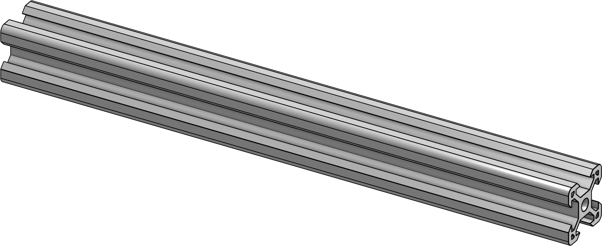
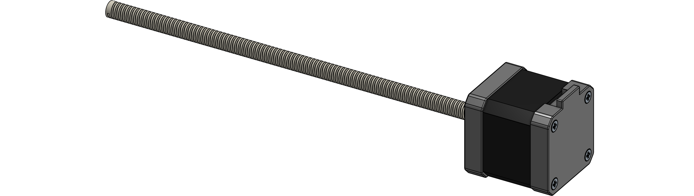

# Z frame

This is the vertical stage (Z-axis) of the printer.

## Required parts

| Amount | Item                           |      |
|--------|--------------------------------|------|
| 6      | 2020 aluminium extrusion 200mm |  |
| 2      | MGN9C 200mm |  |
| 2      | NEMA17 with 200mm lead screw |  |
| **Fasteners** |||
| 8      | M3x8mm SHCS |  |
| 8      | M4x8mm BHCS |  |
| 12     | M6x16mm BHCS |  |
| **Printed parts** |||
| 2      | Z motor mount |  |
