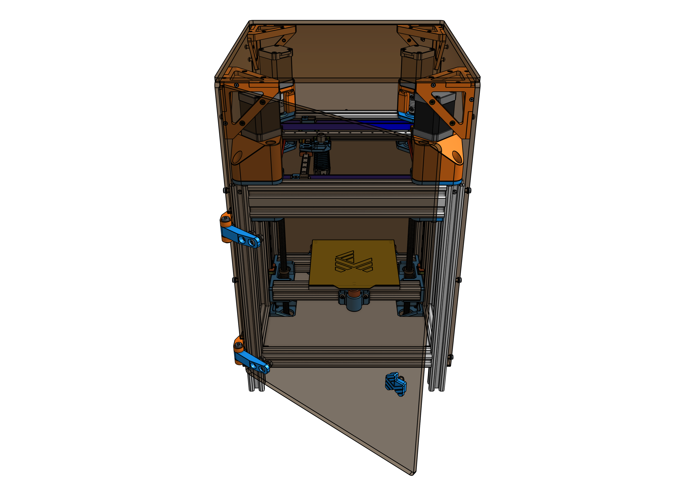

---
# Feel free to add content and custom Front Matter to this file.
# To modify the layout, see https://jekyllrb.com/docs/themes/#overriding-theme-defaults

layout: default
title: Welcome
nav_order: 1
---

# Traquair

## About the project

Traquair is a mini-sized crossed grantry 3D-printer with a build
volume of 120x120x140mm. Inspired by the motion system used by 
[Annex Engineering](https://github.com/Annex-Engineering) and 
form factor of other mini printers like the 
[Voron V0](https://vorondesign.com/voron0), Traquair is a 
desktop-sized 3D-printer with fast printing capabilities.
